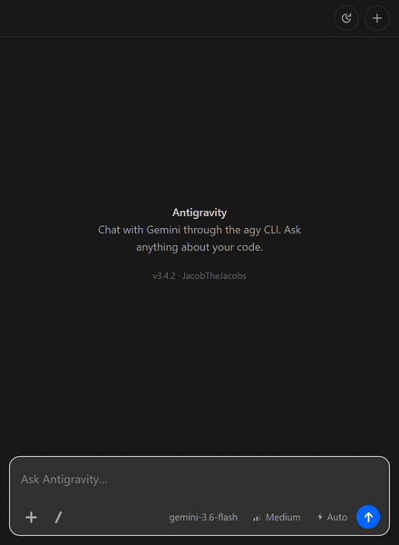
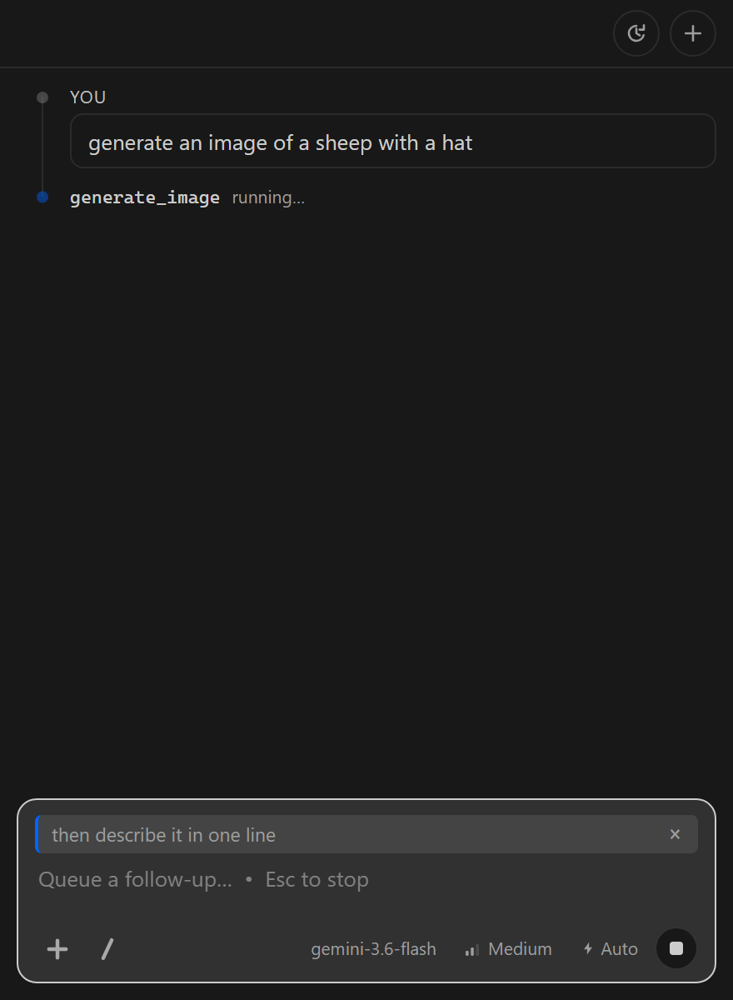
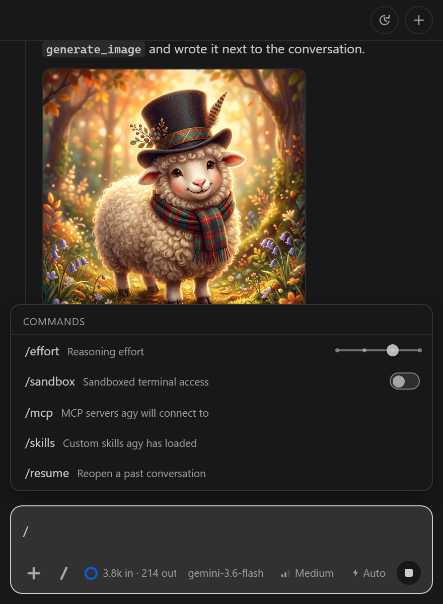
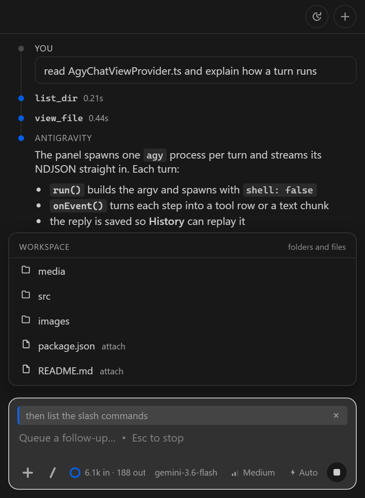

# Antigravity CLI Copilot

**Antigravity, in a real VS Code side panel.** Streaming replies, live tool
calls, generated images inline. No terminal window, no browser tab.

## Why you'll keep it open

**Images and video appear in the chat.** Ask for one and it renders where you
asked — not as a file path you have to go open.

**Type while it's working.** Your follow-up is queued and sent the moment the
turn lands. It never cancels the answer you're waiting on. **Esc** stops.

**Real tool rows, real token counts.** Each row is a step the CLI reported,
with its actual duration. Nothing is estimated.

**Your MCP servers and skills, already loaded.** It reads agy's own config, so
whatever works in the terminal works here.

**`@` a file, paste a screenshot, browse the workspace from `+`.** Context
without leaving the box.

**One `/` for everything else** — model, effort, sandbox, history, agents.

## Install

1. Install this extension.
2. Have the Antigravity CLI. Check it with `agy -p "hello"`.
3. Open the **Antigravity** panel in the secondary side bar and type.

That's it. No API key, no config file, no sign-in flow — `agy` already holds
your Google AI Pro session.

> Google's older standalone CLI can't sign in with a personal account any more;
> it returns `UNSUPPORTED_CLIENT` and points you at Antigravity. This drives the
> CLI that still works.

## What it looks like

| | |
|---|---|
|  | **Queue a follow-up** mid-turn. **Enter** queues, **Esc** stops. |
|  | **`/` for everything.** Effort and sandbox adjust on the row itself. |
|  | **Browse the workspace** from `+`, or `@` a file by name. |

## Modes

**Auto** — agy decides when to ask · **Plan** — explore, never write ·
**Accept edits** — apply without asking. **Shift+Tab** cycles them.

## Under the hood

Each turn spawns one `agy` process and streams its NDJSON straight into the
panel. Sessions live in agy's own store, so conversations you started in the
terminal show up in **History** with the prompt they opened with.

The CLI is launched by absolute path with `shell: false` — nothing in a prompt
or filename ever reaches a shell.

There is no mid-turn steering, because agy cannot accept input while it works:
`input-format` appears nowhere in its binary and `--prompt-interactive` needs a
PTY. A follow-up waits for the turn instead of interrupting it.

## Settings

| Setting | Default | Purpose |
|---|---|---|
| `antigravity.command` | `agy` | Full path to the CLI, if it isn't auto-detected from `~/AppData/Local/agy/bin` or `PATH`. |

## Notes

Maintained by [JacobTheJacobs](https://github.com/JacobTheJacobs) ·
[source](https://github.com/JacobTheJacobs/vscode-antigravity) ·
[report a bug](https://github.com/JacobTheJacobs/vscode-antigravity/issues) · MIT

Unofficial. Not affiliated with Google, Microsoft or GitHub. "Antigravity" is
Google's mark and "Copilot" is Microsoft's; this project only launches a CLI you
already have installed. Prompts and code go to Google's hosted API via `agy` —
this extension makes no network calls of its own.

Slash-command catalog adapted from
[lyadhgod/antigravity-vscode](https://github.com/lyadhgod/antigravity-vscode) (MIT).

## More from JacobTheJacobs

| Build | What it is |
|---|---|
| [**Grok CLI Copilot**](https://marketplace.visualstudio.com/items?itemName=JacobTheJacobs.grok-cli-copilot) | The Grok CLI inside VS Code — chat, agentic edits, full file context in a focused sidebar. |
| **Claw Mate** | Desktop AI pet that watches your coding agents (Claude Code, Codex, OpenClaw) and surfaces approvals the moment they're needed. |
| [**TradingAgents Control Room**](https://github.com/JacobTheJacobs/TradingAgents-Control-Room) | Multi-agent trading floor — AI analysts debate a stock live in pixel art, from analysis through risk to decision. |
| [**Llama Menu**](https://github.com/JacobTheJacobs/llamacpp-menubar) | macOS menu bar control for local llama.cpp, sized from real GGUF metadata. |
| [**Hermes Menu**](https://github.com/JacobTheJacobs/hermes-menubar) | macOS menu bar control for the Hermes gateway, with status read straight from launchd. |
| **Corporate Brawl** · **Floor Planner** · **PixelBoy** | A Three.js office brawler, a 2D-to-3D room planner, and a retro sprite editor — all in the browser. |
| [**Alexa NFT Trending**](https://github.com/JacobTheJacobs/AlexaNftTrending) | Alexa skill that reads out the top trending NFTs by voice (.NET/C#). |

Plus **Browser SDK** and **PhantomPilot**, both under construction. Everything
at [github.com/JacobTheJacobs](https://github.com/JacobTheJacobs).
